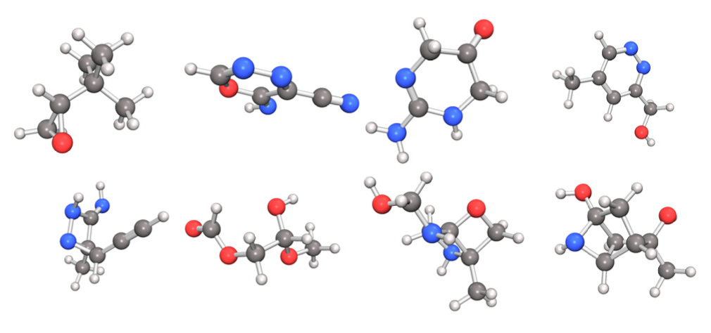
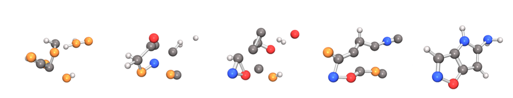

# Bachelor Thesis: Equivariant Neural Diffusion for Molecule Generation
Welcome to my bachelor thesis repo!

This repository provides a from-scratch implementation of an equivariant diffusion model from molecule generation that combines a simplified EDM framework (Hoogeboom et al.) with a PaiNN (Schütt et al.) equivariant GNN. We train it on the QM9 dataset and show that it works great! This work was done as part of my bachelor thesis — it's been fun!

This started out as a super neat repository. Nice class structure, useful inheritance, good folder structure, and more. And then the deadlines hit.. I'll admit, I cut a lot of corners in the end, which is why this repo isn't as nice as I'd like it to be. Perhaps in a future version? For now I need to finish writing. That being said, the functionality is still very much there. 

Here are some samples generated by our model, EDX:


And we can visualise the generation trajectory (or part of it) like we're doing here for the last 20% of the process:

## Overview
This README file contains descriptions of
- Functionality of repo: What can you do with it?
- Installation: How do you get started?
- Training: How do you train models?
- Benchmarking: How do you benchmark models?
- Visualisation: How do you create nice visualisations?
- Repository structure: How is this repository organised? [*might change in the future*]


## Functionality
Below you'll find a guide for installation and training some models - feel free to play around. I provide functionality for lots of things including, but not limited to
- Training and benchmarking PaiNN as a property predictor for regression targets on QM9
- Training and benchmarking EDX models with PaiNN as a backbone on QM9
- Various visualisations used in the thesis report such as 
    - Samples from EDX
    - EDX Generation trajectories and animations of these
    - Predictions on EDX generated samples using a pretrained PaiNN property predictor

## Installation
A conda environment with relevant packages can be installed with
```bash
conda create -n EDX python=3.10
conda activate EDX
pip install -r requirements.txt
```

We add `src` to path to install the EDM package:
```
pip3 install -e .
```

## Training
Train property predictor (choose target_idx $\in \{0, 1, 6, 7, 8, 9, 10, 11\}$). Additional flags include `--p` for fractions of the dataset, `--cutoff_data` to choose specific cutoff values [Å], and more. See `python3 train_prop_pred.py -h` for full settings. 
```
python3 train_prop_pred.py --name prop_pred --target_idx 0 --num_rounds 3 --state_dim 128 --epochs 800 
```

Train EDX model with default settings
```
python3 train_edm.py
```

Train EDX model with variations
```
python3 train_edm.py --num_rounds 9 --state_dim 256 --cutoff_preprocessing 3 --num_blueprints 1000 --atom_scale 0.20 --epochs 800 --noise_schedule cosine --name test
```

## Benchmarking
Benchmark performance of pretrained property predictor, e.g., at `models/mu.pt`
```
python3 benchmark_prop_pred.py --path models/mu.pt --plot_folder plots/mu --plot_name mu_mae
```

Benchmark performance of pretrained EDX model, e.g., `models/edm.pt`
```
python3 benchmark_edm.py --path models/edm.pt --samples 10000
```

## Visualisations
### Samples from models as 3D molecules
Visualise samples from QM9 or an EDX model (`--task` takes [dataset | edm | both]). For an EDX model `models/edm.pt`:
```
python3 visualise.py --task both --path models/edm.pt --samples 8 --edm_save_folder plots/edm --qm9_save_folder plots/qm9
```

Visualise EDX trajectories — plots will be saved in plots/{subfolder}. There are two ways to choose which time steps to visualise. The first is with `--num_checkpoints` which takes an integer, e.g., `6` means `1000, ..., 0` where `...` consists of `4` steps. 
```
python3 -m edm.visualise.trajectory --path models/edm.pt --samples 4 --num_checkpoints 6 --subfolder trajectory
```
or if you want very specific checkpoints, use `--checkpoints` which takes integers like so
```
python3 -m edm.visualise.trajectory --path models/edm.pt --samples 4 --checkpoints 200,150,100,50,0 --subfolder trajectory
```
### Animations of saved trajectories
A visualised trajectory, let's say in a folder `plots/trajectory/sample_00` can be animated using
```
python3 -m edm.visualise.trajectory_animate plots/trajectory/sample_00 --fps 20
```

### Histograms over property distributions on dataset and QM9
If you have both trained property predictors and EDX models, you can replicate the histogram setup used in the distribution coverage part of the report. E.g., for EDX model at `models/edm.pt` and property predictors `models/mu.pt`, `models/u0.pt`, create histograms with
```
python3 src/edm/visualise/edm_qm9_comparison.py --edm_path models/edm.pt --prop_pred_paths models/mu.pt models/U0.pt --samples 5000
```

## Repository structure
The repository is structured as a package. We have scripts like `train_edm.py` and `benchmark_edm.py` which are external, but otherwise all EDM/EDX functionality is found in the `edm` package in `src`. We have 7 different subpackages
- **benchmark**: contains benchmarking functionality for property predictors and EDM/EDX
- **diffusion**: contains all the diffusion stuff, like the `EDM` model class, the `EDMSampler` class, the noise schedules and so on.
- **models**: contains PaiNN package with both PaiNN as a property predictor and a diffusion backbone, with different heads for different purposes.
- **qm9**: contains the `QM9Dataset` class, which admittedly is a bit of a mess currently. Has all the functionality to load in data, do preprocessing like making the data (locally) dense or normalising regression targets and more.
- **trainers**: contains two trainer classes, (1) the `EDMTrainer` and (2), the `PropertyPredictionTrainer` which have all the regular functionality you would expect (at least what *I* would expect)
- **utils**: contains a few random convenient functions
- **visualise**: contains heaps of visualisation scripts used for the report. Heads up, this stuff is largely vibe coded. 